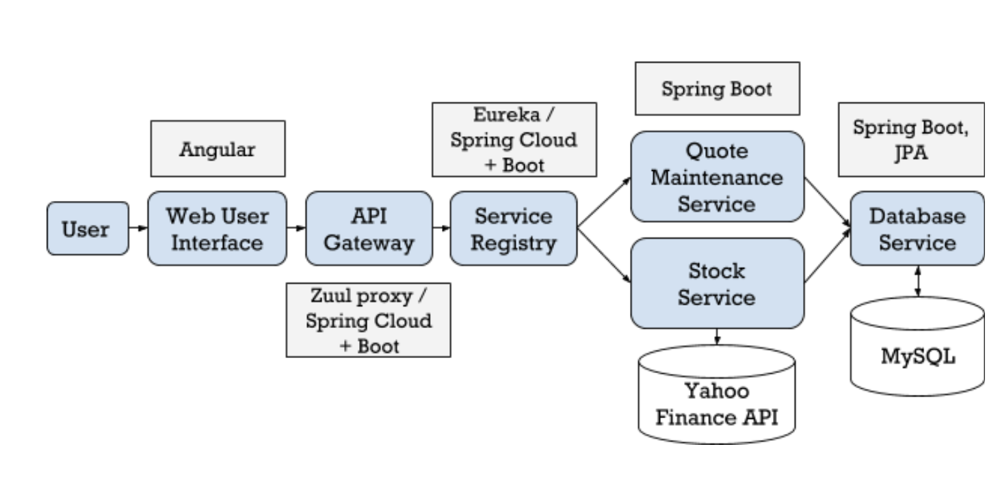

# Microservice-Arcitecture-Project

Reference : https://www.youtube.com/watch?v=rlS9eH5tEnY

A Stock Price Viewer created using Microservice Architecture

## Features:
- `db-service` - MySQL database for storage
- `stock-service` - Pulls Stock Price Information from YahooFinance API
- `eureka-service` - Service Registry for microservices

## Architecture Diagram:

